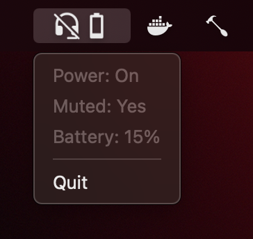
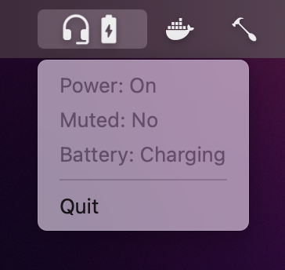

# HyperX Cloud Flight System Tray Monitor

## Introduction

Simple tray application for macOS which shows metrics of a <em>HyperX Cloud Flight Wireless Headset</em>, e.g. battery level.

## Screenshots

    
    

## Getting Started

### Installation Guide

See [latest release](https://github.com/DaPutzy/hyperx-cloud-flight-system-tray/releases/latest).

### Supported operating systems

* macOS

## Help

Feel free to [report any issues](https://github.com/DaPutzy/hyperx-cloud-flight-system-tray/issues) you may have while using this application.

## License

This project is licensed under the MIT License - see the [LICENSE.md](https://github.com/DaPutzy/hyperx-cloud-flight-system-tray/blob/master/LICENSE.md) file for details.

## Other Projects

* [kondinskis/hyperx-cloud-flight](https://github.com/kondinskis/hyperx-cloud-flight) Similar project for Linux and the inspiration behind this project
* [srn/hyperx-cloud-flight-wireless](https://github.com/srn/hyperx-cloud-flight-wireless) Module for interfacing with HyperX Cloud Flight Wireless
